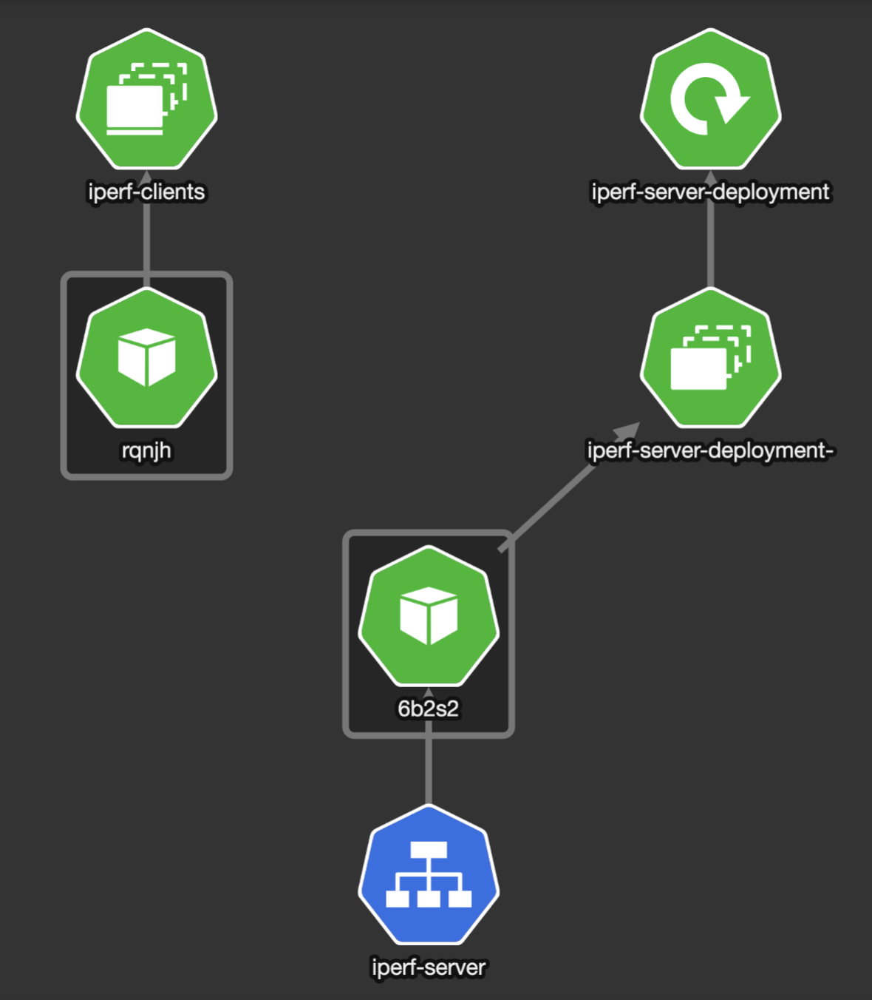
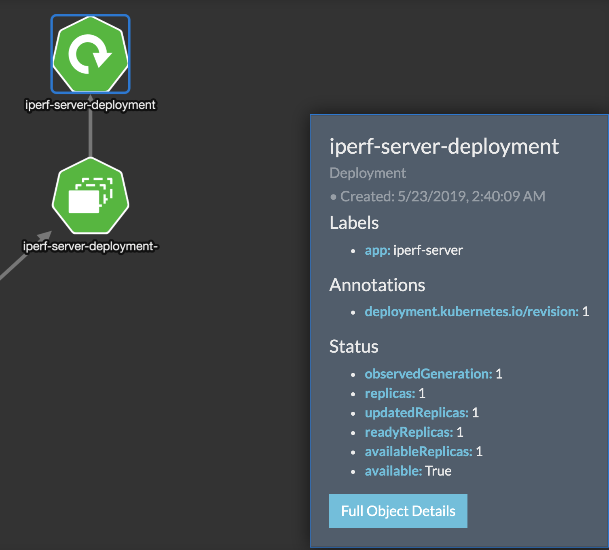
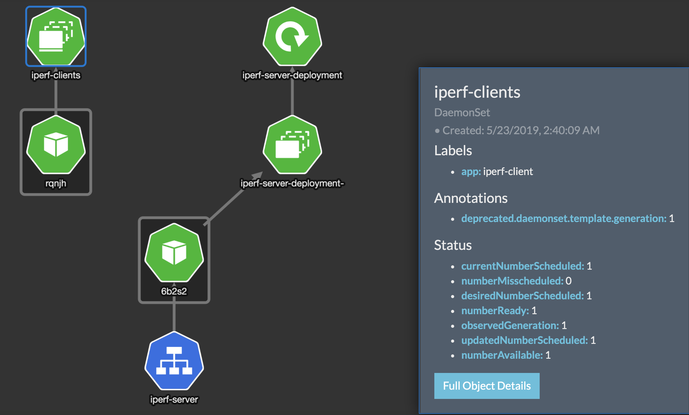
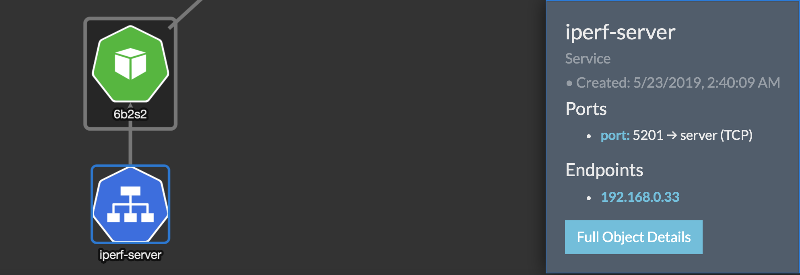

# iperf-on-kubernetes

Network Performance on Kubernetes with Iperf-3


## Topology

By default if "run-iperf.sh" is used:

1. A Iperf-Server is created as a Deployment
2. A Iperf-Client is created as a Daemonset. Each Client will be created on all the nodes including Masters and Iperf will be done for each host.

* Iperf Server and Client as Deployment and Daemonset



* Iperf Server created as a Kubernetes Deployment



* Iperf Clients created as a Kubernetes Daemonsets



* Iperf Server - Service using Service Type: ClusterIP




## Sample Execution of "run-iperf.sh" on a three node cluster (three masters tainted to be nodes)

* A Three node Kubernetes Cluster

```
# kubectl get nodes -o wide

NAME         STATUS   ROLES    AGE   VERSION   INTERNAL-IP   EXTERNAL-IP   OS-IMAGE                                      KERNEL-VERSION               CONTAINER-RUNTIME
australia1   Ready    master   3d    v1.12.2   10.10.10.14   <none>        Red Hat Enterprise Linux Server 7.6 (Maipo)   3.10.0-957.10.1.el7.x86_64   docker://18.9.1
australia2   Ready    master   3d    v1.12.2   10.10.10.15   <none>        Red Hat Enterprise Linux Server 7.6 (Maipo)   3.10.0-957.10.1.el7.x86_64   docker://18.9.1
australia3   Ready    master   3d    v1.12.2   10.10.10.16   <none>        Red Hat Enterprise Linux Server 7.6 (Maipo)   3.10.0-957.10.1.el7.x86_64   docker://18.9.1
```

* Iperf Client, Server and Services on Cluster above

```
# kubectl get pods -o wide

NAME                                       READY   STATUS    RESTARTS   AGE   IP             NODE         NOMINATED NODE
iperf-clients-6c5z5                        1/1     Running   0          6s    192.168.2.19   australia2   <none>
iperf-clients-ks8pm                        1/1     Running   0          6s    192.168.0.21   australia1   <none>
iperf-clients-l9th6                        1/1     Running   0          6s    192.168.1.18   australia3   <none>
iperf-server-deployment-5984568b85-w2pg4   1/1     Running   0          6s    192.168.0.20   australia1   <none>
```

```
# kubectl get all -o wide

NAME                                           READY   STATUS    RESTARTS   AGE   IP             NODE         NOMINATED NODE
pod/iperf-clients-5jjnx                        1/1     Running   0          10s   192.168.0.22   australia1   <none>
pod/iperf-clients-fphs5                        1/1     Running   0          10s   192.168.2.20   australia2   <none>
pod/iperf-clients-mwjg4                        1/1     Running   0          10s   192.168.1.20   australia3   <none>
pod/iperf-server-deployment-5984568b85-2kw68   1/1     Running   0          10s   192.168.1.19   australia3   <none>

NAME                   TYPE        CLUSTER-IP    EXTERNAL-IP   PORT(S)    AGE   SELECTOR
service/iperf-server   ClusterIP   10.103.23.6   <none>        5201/TCP   10s   app=iperf-server
service/kubernetes     ClusterIP   10.96.0.1     <none>        443/TCP    3d    <none>

NAME                           DESIRED   CURRENT   READY   UP-TO-DATE   AVAILABLE   NODE SELECTOR   AGE   CONTAINERS     IMAGES                         SELECTOR
daemonset.apps/iperf-clients   3         3         3       3            3           <none>          10s   iperf-client   gokulpch/iperf3-netperf:v1.0   app=iperf-client

NAME                                      DESIRED   CURRENT   UP-TO-DATE   AVAILABLE   AGE   CONTAINERS     IMAGES                         SELECTOR
deployment.apps/iperf-server-deployment   1         1         1            1           10s   iperf-server   gokulpch/iperf3-netperf:v1.0   app=iperf-server

NAME                                                 DESIRED   CURRENT   READY   AGE   CONTAINERS     IMAGES                         SELECTOR
replicaset.apps/iperf-server-deployment-5984568b85   1         1         1       10s   iperf-server   gokulpch/iperf3-netperf:v1.0   app=iperf-server,pod-template-hash=5984568b85
```

```
# kubectl get svc iperf-server -o yaml

apiVersion: v1
kind: Service
metadata:
  creationTimestamp: 2019-05-23T03:31:21Z
  name: iperf-server
  namespace: default
  resourceVersion: "457070"
  selfLink: /api/v1/namespaces/default/services/iperf-server
  uid: 3ba2be45-7d0b-11e9-8565-3cfdfed10ce0
spec:
  clusterIP: 10.103.22.228
  ports:
  - port: 5201
    protocol: TCP
    targetPort: server
  selector:
    app: iperf-server
  sessionAffinity: None
  type: ClusterIP
status:
  loadBalancer: {}
```

* Running Iperf

```
# ./iperf-on-kubernetes/run-iperf.sh

A Iperf Server is created as a Kubernetes Deployment and Iperf Client is created as a Daemonset
deployment.apps/iperf-server-deployment created
service/iperf-server created
daemonset.apps/iperf-clients created
Server is running

Waiting for iperf-clients-6c5z5 to start...
Client on 10.10.10.15:  Connecting to host iperf-server, port 5201
Client on 10.10.10.15:  [  4] local 192.168.2.19 port 34918 connected to 10.102.244.1 port 5201
Client on 10.10.10.15:  [ ID] Interval           Transfer     Bandwidth       Retr  Cwnd
Client on 10.10.10.15:  [  4]   0.00-1.00   sec   423 MBytes  3.54 Gbits/sec   65    476 KBytes
Client on 10.10.10.15:  [  4]   1.00-2.00   sec   345 MBytes  2.90 Gbits/sec  415    686 KBytes
Client on 10.10.10.15:  [  4]   2.00-3.00   sec   444 MBytes  3.72 Gbits/sec  341    729 KBytes
Client on 10.10.10.15:  [  4]   3.00-4.00   sec   394 MBytes  3.30 Gbits/sec  1201    759 KBytes
Client on 10.10.10.15:  [  4]   4.00-5.00   sec   450 MBytes  3.77 Gbits/sec    0    759 KBytes
Client on 10.10.10.15:  [  4]   5.00-6.00   sec   412 MBytes  3.46 Gbits/sec    0    759 KBytes
Client on 10.10.10.15:  [  4]   6.00-7.00   sec   471 MBytes  3.95 Gbits/sec    0    759 KBytes
Client on 10.10.10.15:  [  4]   7.00-8.00   sec   491 MBytes  4.11 Gbits/sec    0    759 KBytes
Client on 10.10.10.15:  [  4]   8.00-9.00   sec   482 MBytes  4.05 Gbits/sec    0    759 KBytes
Client on 10.10.10.15:  [  4]   9.00-10.00  sec   466 MBytes  3.90 Gbits/sec    0    759 KBytes
Client on 10.10.10.15:  - - - - - - - - - - - - - - - - - - - - - - - - -
Client on 10.10.10.15:  [ ID] Interval           Transfer     Bandwidth       Retr
Client on 10.10.10.15:  [  4]   0.00-10.00  sec  4.28 GBytes  3.67 Gbits/sec  2022             sender
Client on 10.10.10.15:  [  4]   0.00-10.00  sec  4.28 GBytes  3.67 Gbits/sec                  receiver
Client on 10.10.10.15:
Client on 10.10.10.15:  iperf Done.

Client on 10.10.10.14:  Connecting to host iperf-server, port 5201
Client on 10.10.10.14:  [  4] local 192.168.0.21 port 35044 connected to 10.102.244.1 port 5201
Client on 10.10.10.14:  [ ID] Interval           Transfer     Bandwidth       Retr  Cwnd
Client on 10.10.10.14:  [  4]   0.00-1.00   sec  2.46 GBytes  21.2 Gbits/sec   10    827 KBytes
Client on 10.10.10.14:  [  4]   1.00-2.00   sec  2.49 GBytes  21.4 Gbits/sec  417   2.17 MBytes
Client on 10.10.10.14:  [  4]   2.00-3.00   sec  2.37 GBytes  20.4 Gbits/sec    0   2.17 MBytes
Client on 10.10.10.14:  [  4]   3.00-4.00   sec  2.40 GBytes  20.6 Gbits/sec    0   2.17 MBytes
Client on 10.10.10.14:  [  4]   4.00-5.00   sec  2.38 GBytes  20.4 Gbits/sec    0   4.35 MBytes
Client on 10.10.10.14:  [  4]   5.00-6.00   sec  2.45 GBytes  21.1 Gbits/sec    0   4.35 MBytes
Client on 10.10.10.14:  [  4]   6.00-7.00   sec  2.41 GBytes  20.7 Gbits/sec    0   4.35 MBytes
Client on 10.10.10.14:  [  4]   7.00-8.00   sec  2.30 GBytes  19.8 Gbits/sec    0   4.35 MBytes
Client on 10.10.10.14:  [  4]   8.00-9.00   sec  2.42 GBytes  20.8 Gbits/sec    0   7.35 MBytes
Client on 10.10.10.14:  [  4]   9.00-10.00  sec  2.46 GBytes  21.1 Gbits/sec    0   7.35 MBytes
Client on 10.10.10.14:  - - - - - - - - - - - - - - - - - - - - - - - - -
Client on 10.10.10.14:  [ ID] Interval           Transfer     Bandwidth       Retr
Client on 10.10.10.14:  [  4]   0.00-10.00  sec  24.1 GBytes  20.7 Gbits/sec  427             sender
Client on 10.10.10.14:  [  4]   0.00-10.00  sec  24.1 GBytes  20.7 Gbits/sec                  receiver
Client on 10.10.10.14:
Client on 10.10.10.14:  iperf Done.

Client on 10.10.10.16:  Connecting to host iperf-server, port 5201
Client on 10.10.10.16:  [  4] local 192.168.1.18 port 59200 connected to 10.102.244.1 port 5201
Client on 10.10.10.16:  [ ID] Interval           Transfer     Bandwidth       Retr  Cwnd
Client on 10.10.10.16:  [  4]   0.00-1.00   sec   436 MBytes  3.65 Gbits/sec   30    419 KBytes
Client on 10.10.10.16:  [  4]   1.00-2.00   sec   452 MBytes  3.79 Gbits/sec    2    507 KBytes
Client on 10.10.10.16:  [  4]   2.00-3.00   sec   410 MBytes  3.44 Gbits/sec    0    507 KBytes
Client on 10.10.10.16:  [  4]   3.00-4.00   sec   442 MBytes  3.71 Gbits/sec    0    507 KBytes
Client on 10.10.10.16:  [  4]   4.00-5.00   sec   456 MBytes  3.83 Gbits/sec    0    507 KBytes
Client on 10.10.10.16:  [  4]   5.00-6.00   sec   376 MBytes  3.15 Gbits/sec  320    624 KBytes
Client on 10.10.10.16:  [  4]   6.00-7.00   sec   425 MBytes  3.56 Gbits/sec    0    624 KBytes
Client on 10.10.10.16:  [  4]   7.00-8.00   sec   472 MBytes  3.96 Gbits/sec    0    624 KBytes
Client on 10.10.10.16:  [  4]   8.00-9.00   sec   478 MBytes  4.01 Gbits/sec    0    624 KBytes
Client on 10.10.10.16:  [  4]   9.00-10.00  sec   474 MBytes  3.97 Gbits/sec    0    624 KBytes
Client on 10.10.10.16:  - - - - - - - - - - - - - - - - - - - - - - - - -
Client on 10.10.10.16:  [ ID] Interval           Transfer     Bandwidth       Retr
Client on 10.10.10.16:  [  4]   0.00-10.00  sec  4.32 GBytes  3.71 Gbits/sec  352             sender
Client on 10.10.10.16:  [  4]   0.00-10.00  sec  4.32 GBytes  3.71 Gbits/sec                  receiver
Client on 10.10.10.16:
Client on 10.10.10.16:  iperf Done.

deployment.apps "iperf-server-deployment" deleted
service "iperf-server" deleted
daemonset.apps "iperf-clients" deleted
```